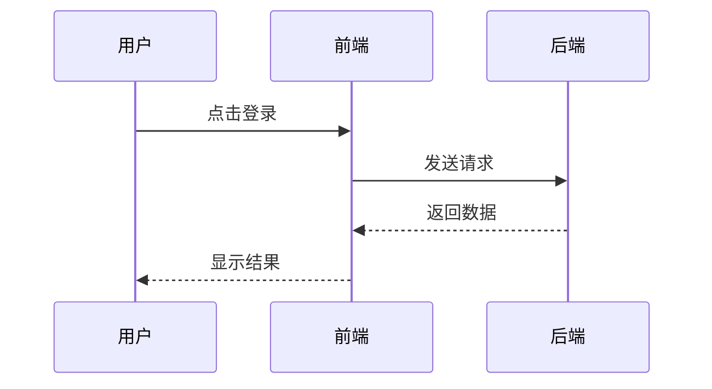

```mermaid
sequenceDiagram
    participant 用户
    participant 前端
    participant 后端
    用户->>前端: 点击登录
    前端->>后端: 发送请求
    后端-->>前端: 返回数据
    前端-->>用户: 显示结果
```

$$
\int_{-\infty}^{\infty} e^{-x^2} dx = \sqrt{\pi}
$$